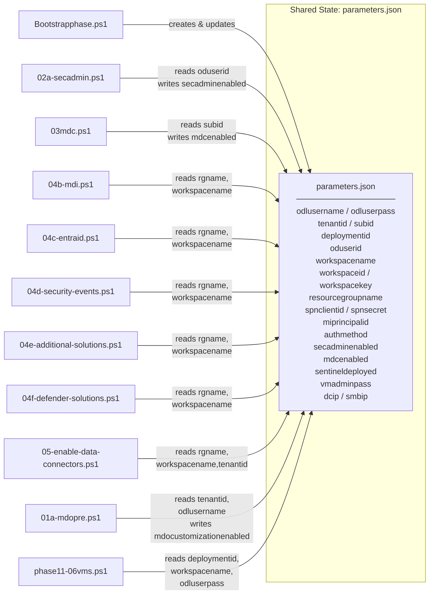

# UniSecOps Lab - Unified Security Operations Deployment

## Overview

UniSecOps is a **fully automated Azure security lab** that deploys a complete Microsoft Security Operations environment including Microsoft Sentinel, Defender for Cloud, Active Directory VMs, and attack simulations — all orchestrated through a phased bootstrap pipeline.

The lab is designed for **CloudLabs** (training/workshop platform) and provisions everything from a single ARM template deployment that triggers a bootstrap PowerShell script on a LabVM.

---

## Architecture Diagram

```mermaid
flowchart TB
    subgraph ARM["ARM Template Deployment"]
        UD["unideploy1.json<br/>(with SPN)"]
        A1["agent1-01.json<br/>(without SPN)"]
        P1["parameters.json"]
        AP["agent1-01.parameter.json"]
        UD --> |"parameters"| P1
        A1 --> |"parameters"| AP
    end

    subgraph BOOTSTRAP["Bootstrap Orchestrator"]
        BS["Bootstrapphase.ps1<br/>(with SPN)"]
        PS["psscriptspn.ps1<br/>(without SPN)"]
    end

    ARM --> |"CustomScriptExtension<br/>triggers on LabVM"| BOOTSTRAP

    subgraph PHASE0["Phase 0 - Initialize"]
        INIT["Create parameters.json<br/>Download all scripts<br/>from Azure Blob Storage"]
    end

    subgraph PHASE1["Phase 1 - Prerequisites"]
        PRE["Install Azure CLI<br/>Install VS Code<br/>Install NuGet/PSGallery<br/>Install Az Modules<br/>Install Graph Modules"]
    end

    subgraph PHASE15["Phase 1.5 - MI Elevation"]
        MI["Elevate Managed Identity<br/>Assign Owner (Subscription)<br/>Assign Global Admin (Entra ID)<br/>Auth Chain: SPN → TAP → Password"]
    end

    subgraph PHASE2["Phase 2 - Authentication"]
        AUTH["Verify Azure Auth<br/>MI → SPN fallback"]
    end

    subgraph PHASE35["Phase 3.5 - User Lookup"]
        USER["Lookup ODL User Object ID<br/>via Microsoft Graph"]
    end

    subgraph PHASE4["Phase 4 - Security Admin"]
        SEC["02a-secadmin.ps1<br/>Assign Security Administrator<br/>Entra ID directory role"]
    end

    subgraph PHASE5["Phase 5 - Defender for Cloud"]
        MDC["03mdc.ps1<br/>Enable MDC Plans:<br/>VirtualMachines, SqlServers,<br/>AppServices, Storage,<br/>Containers, CloudPosture,<br/>KeyVaults, AI, etc."]
    end

    subgraph PHASE6["Phase 6 - Microsoft Sentinel"]
        direction TB
        SENT["Deploy Sentinel Workspace<br/>(sentinel-template.json)"]
        MDI["04b-mdi.ps1<br/>Defender for Identity Solution"]
        ENTRA["04c-entraid.ps1<br/>Entra ID Solution +<br/>15 Diagnostic Log Types"]
        SECEVT["04d-security-events.ps1<br/>Windows Security Events +<br/>Data Collection Rules"]
        ADDSOL["04e-additional-solutions.ps1<br/>10 Content Hub Solutions"]
        DEFSOL["04f-defender-solutions.ps1<br/>Defender XDR, O365,<br/>Cloud Apps Solutions"]
        DC2["05-enable-data-connectors.ps1<br/>Threat Intelligence +<br/>Data Connectors"]
        SENT --> MDI --> ENTRA --> SECEVT --> ADDSOL --> DEFSOL --> DC2
    end

    subgraph PHASE8["Phase 8 - MDO"]
        MDOPRE["01a-mdopre.ps1<br/>Enable Organization<br/>Customization (Exchange)"]
    end

    subgraph PHASE105["Phase 10.5 - MDE Integration"]
        MDE["Enable WDATP +<br/>Unified Solution +<br/>Auto-provisioning +<br/>MdeDesignatedSubscription"]
    end

    subgraph PHASE11["Phase 11 - Deploy VMs"]
        direction TB
        VMS["phase11-06vms.ps1<br/>Orchestrate VM Deployment"]
        DCJSON["dc.json<br/>ARM: Domain Controller VM<br/>UniSecOps-DC-{ID}<br/>10.0.1.4"]
        SMBJSON["smb.json<br/>ARM: File Server VM<br/>UniSecOps-SMB-{ID}<br/>10.0.1.5"]
        SETUPDC["setup-dc.ps1<br/>Install AD DS<br/>Promote to DC<br/>Create User01<br/>Disable Firewall"]
        SETUPSMB["setup-smb.ps1<br/>Join Domain<br/>Install File Server<br/>Create SMB Share<br/>Disable Firewall"]
        VMS --> DCJSON --> SETUPDC
        VMS --> SMBJSON --> SETUPSMB
    end

    subgraph PHASE13["Phase 13 - Attack Simulations"]
        direction TB
        DCATK["dcscript.ps1<br/>DC Attacks: Recon,<br/>Credential Dump, LSASS,<br/>NTDS.dit, DCSync,<br/>Kerberoasting, Priv Esc"]
        SMBATK["smbscript.ps1<br/>SMB Attacks: Recon,<br/>SAM Export, LSASS,<br/>Lateral Movement,<br/>Brute Force to DC"]
        COMMON["commonran.ps1<br/>Ransomware Simulation:<br/>Mass file encryption,<br/>Shadow copy deletion,<br/>Recovery disable"]
    end

    BOOTSTRAP --> PHASE0 --> PHASE1 --> PHASE15 --> PHASE2 --> PHASE35
    PHASE35 --> PHASE4 --> PHASE5 --> PHASE6 --> PHASE8
    PHASE8 --> PHASE105 --> PHASE11 --> PHASE13

    COMMON --> |"Runs on both"| DCATK
    COMMON --> |"Runs on both"| SMBATK

    classDef arm fill:#2d6bcf,color:#fff,stroke:#1a4a9e
    classDef boot fill:#e67e22,color:#fff,stroke:#d35400
    classDef phase fill:#27ae60,color:#fff,stroke:#1e8449
    classDef sentinel fill:#8e44ad,color:#fff,stroke:#6c3483
    classDef vm fill:#c0392b,color:#fff,stroke:#922b21
    classDef attack fill:#e74c3c,color:#fff,stroke:#c0392b

    class UD,A1,P1,AP arm
    class BS,PS boot
    class INIT,PRE,MI,AUTH,USER phase
    class SEC,MDC,MDOPRE,MDE phase
    class SENT,MDI,ENTRA,SECEVT,ADDSOL,DEFSOL,DC2 sentinel
    class VMS,DCJSON,SMBJSON,SETUPDC,SETUPSMB vm
    class DCATK,SMBATK,COMMON attack
```



---

## Deployment Flow (Execution Order)

```
┌─────────────────────────────────────────────────────────────────┐
│                    ARM TEMPLATE DEPLOYMENT                       │
│  unideploy1.json + parameters.json (or agent1-01.json)          │
│  → Deploys LabVM + CustomScriptExtension                        │
└───────────────────────────┬─────────────────────────────────────┘
                            │ Triggers
                            ▼
┌─────────────────────────────────────────────────────────────────┐
│          BOOTSTRAP ORCHESTRATOR (Bootstrapphase.ps1)            │
│          or psscriptspn.ps1 (no SPN variant)                    │
├─────────────────────────────────────────────────────────────────┤
│                                                                 │
│  Phase 0   ► Init params.json + Download all scripts from Blob  │
│  Phase 1   ► Install Azure CLI, VS Code, Az/Graph modules       │
│  Phase 1.5 ► Elevate Managed Identity (Owner + Global Admin)    │
│  Phase 2   ► Verify Azure Authentication (MI/SPN/Password)      │
│  Phase 3   ► TAP Creation (SKIPPED - MI auth used instead)      │
│  Phase 3.5 ► Lookup ODL User Object ID via Graph API            │
│  Phase 4   ► Assign Security Admin Role ──► 02a-secadmin.ps1    │
│  Phase 5   ► Enable Defender for Cloud ───► 03mdc.ps1           │
│  Phase 6   ► Configure Sentinel ──────────► sentinel-template   │
│      6b    ►   MDI Solution ──────────────► 04b-mdi.ps1         │
│      6c    ►   Entra ID Solution ─────────► 04c-entraid.ps1     │
│      6d    ►   Security Events ───────────► 04d-security-events │
│      6e    ►   Additional Solutions ──────► 04e-additional-sol.. │
│      6f    ►   Defender Solutions ────────► 04f-defender-sol..   │
│      6h    ►   Data Connectors ───────────► 05-enable-data-conn │
│  Phase 7   ► MDI Workspace (SKIPPED - Playwright/manual)        │
│  Phase 8   ► MDO Pre-config ─────────────► 01a-mdopre.ps1      │
│  Phase 9   ► MDE Advanced (SKIPPED - Playwright/manual)         │
│  Phase 10  ► Defender Tables (SKIPPED - Playwright/manual)      │
│  Phase 10.5► Enable MDE Integration (WDATP)                     │
│  Phase 11  ► Deploy AD VMs ──────────────► phase11-06vms.ps1    │
│      DC    ►   Domain Controller ────────► dc.json + setup-dc   │
│      SMB   ►   File Server ──────────────► smb.json + setup-smb │
│  Phase 12  ► Deploy Kali Attack VM (SKIPPED if not available)   │
│  Phase 13  ► Execute Attack Simulations                         │
│      DC    ►   DC attacks ───────────────► dcscript.ps1         │
│      SMB   ►   SMB attacks ──────────────► smbscript.ps1        │
│      Both  ►   Ransomware sim ───────────► commonran.ps1        │
│                                                                 │
└─────────────────────────────────────────────────────────────────┘
```

---

## File Reference

### Deployment Entry Points (ARM Templates)

| File | Description |
|------|-------------|
| **unideploy1.json** | Main ARM template (with SPN support). Deploys LabVM with CustomScriptExtension that downloads and runs the bootstrap script. Includes SPN parameters for elevated auth. |
| **parameters.json** | ARM deployment parameters. Placeholders like `GET-AZUSER-UPN` are replaced by CloudLabs at deploy time. |
| **agent1-01.json** | Alternative ARM template (without SPN). Same structure but SPN parameters removed for simpler deployment. |
| **agent1-01.parameter.json** | Parameters for the no-SPN ARM template variant. |

### Bootstrap Orchestrators

| File | Description |
|------|-------------|
| **Bootstrapphase.ps1** | **Main orchestrator (with SPN)**. Runs Phases 0→13 sequentially with retry logic, status tracking, and resume support. Downloads all sub-scripts from Azure Blob Storage. Accepts SPN credentials for initial MI elevation. |
| **psscriptspn.ps1** | **Alternative orchestrator (without SPN)**. Same phase execution but SPN params removed. MI role assignment must be done manually beforehand. Also includes CloudLabs EmbeddedShadow trainer account setup. |

### Phase 4 - Security Admin

| File | Description |
|------|-------------|
| **02a-secadmin.ps1** | Assigns the **Security Administrator** Entra ID directory role to the ODL lab user via Microsoft Graph API. Reads user object ID from `parameters.json`. |

### Phase 5 - Microsoft Defender for Cloud

| File | Description |
|------|-------------|
| **03mdc.ps1** | Enables **13 Defender for Cloud plans** (VirtualMachines/P2, SqlServers, AppServices, StorageAccounts, Containers, CloudPosture, KeyVaults, Arm, CosmosDbs, API, AI, etc.). Enables automatic MDE onboarding for VMs. |

### Phase 6 - Microsoft Sentinel (6 sub-scripts)

| File | Description |
|------|-------------|
| **sentinel-template.json** | ARM template that deploys the **Log Analytics Workspace** + **Microsoft Sentinel** (SecurityInsights solution). Creates workspace `UniSecOps-sentinel-{DeploymentID}`. Enables UEBA with Entra ID data source. |
| **04b-mdi.ps1** | Deploys **Microsoft Defender for Identity** solution to Sentinel. Downloads MDI template from GitHub, deploys it, then enables MDI analytics rules from templates. |
| **04c-entraid.ps1** | Deploys **Microsoft Entra ID** solution to Sentinel. Configures **all 15 Entra ID diagnostic log types** (SignInLogs, AuditLogs, NonInteractiveUserSignInLogs, etc.) to stream to the workspace. |
| **04d-security-events.ps1** | Deploys **Windows Security Events** solution. Configures "All events" collection tier and creates a **Data Collection Rule (DCR)** for AMA-based Windows Security Event streaming. |
| **04e-additional-solutions.ps1** | Deploys **10 additional Content Hub solutions**: Endpoint Threat Protection Essentials, Log4j Detection, Defender for Cloud, Network Session Essentials, Security Threat Essentials, SOAR Essentials, Defender Threat Intelligence, UEBA Essentials, Attacker Tools Protection, Azure Activity. |
| **04f-defender-solutions.ps1** | Deploys **3 Microsoft Defender solutions**: Defender XDR, Defender for Office 365, Defender for Cloud Apps. Enables analytics rules from deployed solution templates. |
| **05-enable-data-connectors.ps1** | Installs **Threat Intelligence (NEW)** Content Hub solution and enables data connectors: Microsoft Threat Intelligence, Defender Threat Intelligence, and Threat Intelligence Platforms. |

### Phase 8 - Microsoft Defender for Office 365

| File | Description |
|------|-------------|
| **01a-mdopre.ps1** | Connects to **Exchange Online** (via Managed Identity, token fallback, or SPN) and runs `Enable-OrganizationCustomization` to hydrate the tenant for MDO policy configuration. |

### Phase 11 - VM Deployment (Active Directory Lab)

| File | Description |
|------|-------------|
| **phase11-06vms.ps1** | **VM deployment orchestrator**. Creates a separate resource group `UniSecOps-VMs-{ID}`, provisions a VNet (10.0.1.0/24), then deploys DC and SMB VMs via nested ARM templates. Configures MDE onboarding and DCR associations. |
| **dc.json** | ARM template for the **Domain Controller VM** (`UniSecOps-DC-{ID}`). Windows Server 2022, Standard_D2s_v3, static IP 10.0.1.4. NSG wide-open for attack testing. Runs `setup-dc.ps1` via CustomScriptExtension. |
| **smb.json** | ARM template for the **File Server VM** (`UniSecOps-SMB-{ID}`). Windows Server 2022, Standard_D2s_v3, static IP 10.0.1.5. DNS points to DC. Runs `setup-smb.ps1` via CustomScriptExtension. |
| **setup-dc.ps1** | Runs inside DC VM. Installs **AD Domain Services**, promotes to Domain Controller for `corp.contoso.com`, creates `User01` domain account, disables firewall & SmartScreen, sets up auto-login, prepares for MDI sensor. |
| **setup-smb.ps1** | Runs inside SMB VM. Waits for DC readiness, **joins `corp.contoso.com` domain**, installs File Server role, creates `C:\Share` SMB share with Domain Users access, creates test files, disables firewall. |

### Phase 13 - Attack Simulations

| File | Description |
|------|-------------|
| **dcscript.ps1** | **DC attack script**. Executes MITRE ATT&CK techniques on the Domain Controller: credential dumps (SAM, LSASS, NTDS.dit via VSS), Kerberoasting, DCSync replication, sticky keys backdoor, malicious service creation, password spray, event log clearing, privilege escalation. |
| **smbscript.ps1** | **SMB attack script**. Executes workstation-focused attacks on the File Server: LSASS access, SAM export, credential manager dump, lateral movement probes to DC (SMB, WinRM, RDP, PsExec-style), brute force attempts, network discovery. |
| **commonran.ps1** | **Ransomware simulation** (runs on both DC and SMB). Creates 600+ bait files, mass-renames to `.WNCRY`/`.DARKSIDE` extensions, deletes shadow copies, disables recovery, stops backup services. Cleans up after 120s. Triggers MDE ransomware alerts. |

---

## Data Flow & Interconnections



### Key Interconnections

1. **`parameters.json` is the central state file** — every script reads from it and most write status back to it. The bootstrap creates it in Phase 0, and subsequent phases enrich it with workspace IDs, keys, and completion flags.

2. **Authentication chain flows down**: Phase 1.5 (MI elevation) → Phase 2 (auth verify) → all subsequent phases use Managed Identity. Fallback: SPN → TAP → Password.

3. **Sentinel workspace must exist before solutions**: `sentinel-template.json` (Phase 6) creates the workspace. All 04x scripts depend on `workspacename` and `resourcegroupname` being set.

4. **VM deployment depends on Sentinel**: `phase11-06vms.ps1` requires `workspacename` to configure MDE onboarding and DCR associations for the VMs. MDC (Phase 5) must be enabled first for auto MDE onboarding.

5. **DC must be ready before SMB**: `setup-smb.ps1` waits up to 10 minutes for the Domain Controller to respond before attempting domain join.

6. **Attack scripts depend on AD infrastructure**: `dcscript.ps1` requires a promoted DC with Active Directory. `smbscript.ps1` requires a domain-joined file server. `commonran.ps1` runs on both machines independently.

7. **Two deployment variants**:
   - **With SPN**: `unideploy1.json` + `parameters.json` + `Bootstrapphase.ps1` — SPN credentials passed in for initial MI elevation
   - **Without SPN**: `agent1-01.json` + `agent1-01.parameter.json` + `psscriptspn.ps1` — MI role assignment done manually before deployment

---

## Network Topology

```
┌──────────────────────────────────────────────────┐
│              Azure Subscription                   │
│                                                   │
│  ┌─────────────────────────────────────────────┐  │
│  │  Resource Group: secops                     │  │
│  │  ┌───────────────────────────────────────┐  │  │
│  │  │  Log Analytics Workspace              │  │  │
│  │  │  UniSecOps-sentinel-{DeploymentID}    │  │  │
│  │  │  + Microsoft Sentinel                 │  │  │
│  │  │  + 16 Solutions (MDI, Entra ID, etc.) │  │  │
│  │  │  + Data Connectors (TI, WDATP, etc.)  │  │  │
│  │  └───────────────────────────────────────┘  │  │
│  │  ┌───────────────────────────────────────┐  │  │
│  │  │  LabVM (where bootstrap runs)         │  │  │
│  │  │  System-assigned Managed Identity     │  │  │
│  │  │  → Owner on Subscription              │  │  │
│  │  │  → Global Admin in Entra ID           │  │  │
│  │  └───────────────────────────────────────┘  │  │
│  └─────────────────────────────────────────────┘  │
│                                                   │
│  ┌─────────────────────────────────────────────┐  │
│  │  Resource Group: UniSecOps-VMs-{ID}         │  │
│  │  VNet: UniSecOps-VNet-{ID} (10.0.1.0/24)   │  │
│  │                                              │  │
│  │  ┌──────────────────┐ ┌──────────────────┐  │  │
│  │  │ UniSecOps-DC-{ID}│ │UniSecOps-SMB-{ID}│  │  │
│  │  │ 10.0.1.4         │ │ 10.0.1.5         │  │  │
│  │  │ Domain Controller│ │ File Server       │  │  │
│  │  │ corp.contoso.com │ │ Domain-joined     │  │  │
│  │  │ Win Server 2022  │ │ Win Server 2022   │  │  │
│  │  │ AD DS + DNS      │ │ SMB Share         │  │  │
│  │  │ MDE onboarded    │ │ MDE onboarded     │  │  │
│  │  └──────────────────┘ └──────────────────┘  │  │
│  └─────────────────────────────────────────────┘  │
│                                                   │
│  ┌─────────────────────────────────────────────┐  │
│  │  Microsoft Defender for Cloud               │  │
│  │  13 Plans Enabled (Servers P2, CSPM, etc.)  │  │
│  │  WDATP + Unified Solution + Auto-provision  │  │
│  └─────────────────────────────────────────────┘  │
│                                                   │
│  ┌─────────────────────────────────────────────┐  │
│  │  Entra ID                                   │  │
│  │  Lab User → Security Administrator role     │  │
│  │  LabVM MI → Global Administrator + Owner    │  │
│  │  Domain: corp.contoso.com (AD DS)           │  │
│  └─────────────────────────────────────────────┘  │
└──────────────────────────────────────────────────┘
```

---

## Attack Simulation Coverage (MITRE ATT&CK)

| Technique | ID | Script | Target |
|---|---|---|---|
| Account Discovery | T1087 | dcscript, smbscript | DC, SMB |
| System Information Discovery | T1082 | dcscript, smbscript | DC, SMB |
| OS Credential Dumping (LSASS) | T1003.001 | dcscript, smbscript | DC, SMB |
| OS Credential Dumping (NTDS) | T1003.003 | dcscript | DC |
| OS Credential Dumping (SAM) | T1003.002 | dcscript, smbscript | DC, SMB |
| DCSync | T1003.006 | dcscript | DC |
| Kerberoasting | T1558.003 | dcscript | DC |
| Accessibility Features (Sticky Keys) | T1546.008 | dcscript | DC |
| Create/Modify System Process | T1543.003 | dcscript | DC |
| Brute Force | T1110 | dcscript, smbscript | DC, SMB |
| Remote Services (SMB/WinRM) | T1021 | smbscript | SMB→DC |
| Lateral Movement (PsExec-style) | T1570 | smbscript | SMB→DC |
| Data Encrypted for Impact | T1486 | commonran | DC, SMB |
| Inhibit System Recovery | T1490 | commonran | DC, SMB |
| Service Stop | T1489 | commonran | DC, SMB |
| Indicator Removal (Log Clear) | T1070.001 | dcscript | DC |

---

## Manual Steps (Playwright/Browser Required)

These phases are skipped in automation and must be done manually:

| Phase | Task |
|---|---|
| **Phase 7** | MDI Workspace creation (requires portal interaction) |
| **Phase 9** | MDE Advanced Features enablement |
| **Phase 10** | Defender Tables configuration |
